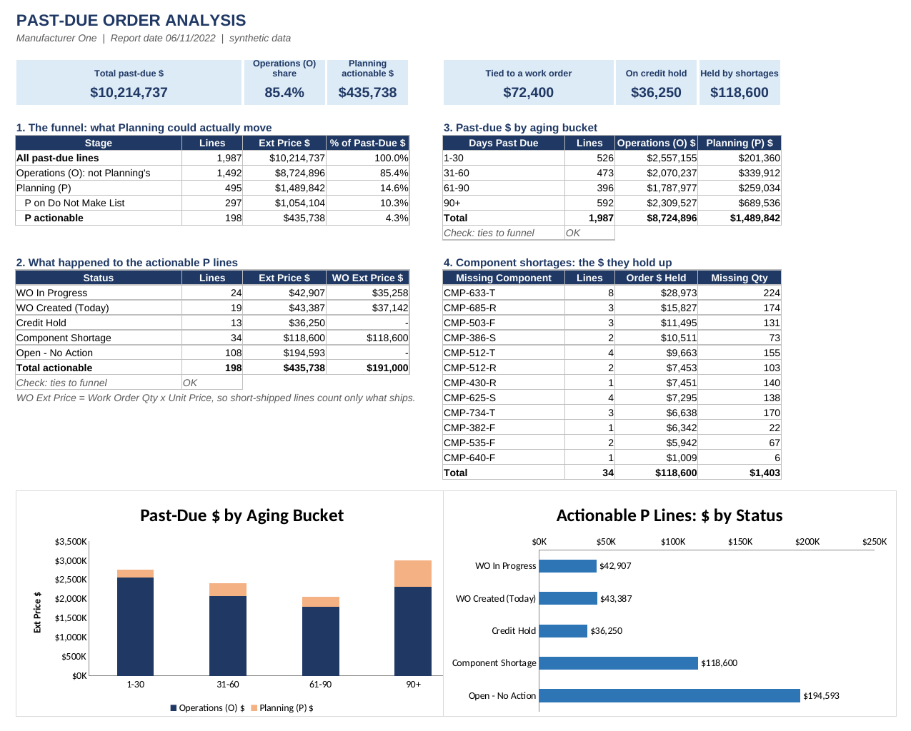
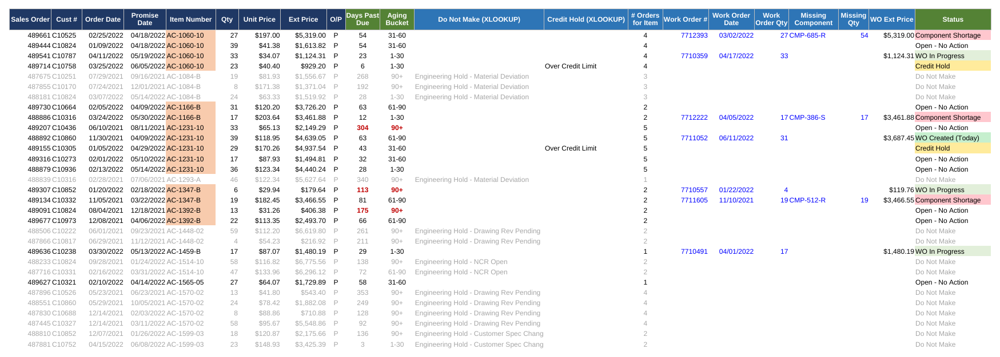

# Past-Due Order Analysis: Manufacturer One

**Excel · XLOOKUP · Conditional Formatting · SUMIFS · Aging Analysis**

> Manufacturer One is an aerospace components manufacturer. All data in this project is synthetic: item numbers, customers, orders, dates and dollar amounts are invented. The problem, the process and the proportions are real.



## The problem

Manufacturer One had **more than $10M in past-due orders**. The parts go into aircraft, so anything with an open engineering issue couldn't ship. Nobody wants to find out what happens when gravity wins.

The master planner used to send the schedulers a daily list of past-due work orders to clear by end of day. As she got pulled in more directions, that list went from daily to every other day, then weekly, then "whenever." The message from leadership stayed the same: *make more work orders and the past-due number will drop.*

## The question

On a Saturday overtime shift, my planned project finished in an hour instead of the whole morning. I got the same daily past-due export the master planner did, so I saved a copy and started digging.

**How much of this past-due number can Planning actually move?**

## What I did

| Step | Action | Lines left |
|---|---|---|
| 1 | Opened the raw export: ~2,000 lines, with a wall of meaningless columns before the useful ones (Order Date, Promise Date, Item Number, Qty, Unit Price, Ext Price, O/P) | ~2,000 |
| 2 | Filtered on the last column, **O/P**. *O* = Operations (on the floor or at a vendor). *P* = Planning, actually ours to fix. About 1,500 lines were O's. I moved the P's to their own sheet. | ~500 |
| 3 | **XLOOKUP** of every Item Number against the *Do Not Make List* (engineering holds that can't be built without approval) | ~200 |
| 4 | **Conditional formatting** to flag items with multiple open orders, so work orders could be combined | ~200 |
| 5 | Worked the list: flagged lines already tied to a work order, created work orders (short-shipping where it moved the number), found credit holds, and logged the component shortages with the dollars they were holding up | done |

## What I found

- **~85% of past-due dollars were Operations (O)**, not Planning. More work orders could never have cleared them.
- **~$72k** was already tied to a work order or got one that day.
- **~$36k** was sitting on **credit hold**. That was a whole other can of snakes, and nobody had been tracking it against past due.
- Component shortages now had **hard dollar figures**: $118k in orders held up, broken out by missing component.

Past due stopped being "make more work orders" and became a list of who owns each dollar.

## Inside the workbook

`Manufacturer_One_Past_Due_Analysis.xlsx`

| Tab | What's there |
|---|---|
| **About** | The story, a color legend, and the Report Date input that drives every aging calculation |
| **Dashboard** | KPI tiles, the O/P funnel, $ by status, $ by aging bucket (1–30 / 31–60 / 61–90 / 90+), and shortage $ by component, with two charts and built-in tie-out checks |
| **Planning Work** | The P lines, with XLOOKUPs, duplicate highlighting, work order and shortage columns, and a Status formula |
| **Past Due Report** | The raw ~2,000-line export, useless columns included |
| **Do Not Make List** | Engineering-hold items |
| **Credit Hold List** | Customers on credit hold |



> **Opening the file:** the XLOOKUP formulas need Excel for Microsoft 365, Excel 2021 or later, or the free Excel for the web. Older versions show the saved results but can't recalculate them.

### Key formulas

```excel
Do Not Make    =XLOOKUP(E2, 'Do Not Make List'!$A$2:$A$500, 'Do Not Make List'!$B$2:$B$500, "")
Credit Hold    =XLOOKUP(B2, 'Credit Hold List'!$A$2:$A$100, 'Credit Hold List'!$B$2:$B$100, "")
Duplicates     =COUNTIF($E$2:$E$496, E2)            (plus a matching conditional-format rule)
Days Past Due  =ReportDate - D2
Aging Bucket   =IF(J2<=30,"1-30",IF(J2<=60,"31-60",IF(J2<=90,"61-90","90+")))
Aging $        =SUMIFS(Ext, O/P, "O", PromiseDate, "<="&(ReportDate-31), PromiseDate, ">="&(ReportDate-60))
```

## Then vs. now

That Saturday was early days for me in Excel. Rebuilding it, I kept what I actually did and added what I'd do today:

| Then | Now |
|---|---|
| Copy/pasted Ext Price next to each work order | **WO Ext Price = Work Order Qty × Unit Price**, so short-shipped lines count only what actually ships |
| No aging | **Days Past Due** and **Aging Bucket** columns, plus an aging chart by O vs P |
| Tallied totals by hand | A **Status** formula and **SUMIFS** dashboard that recalculate when any line changes |
| – | **Tie-out checks** so the dashboard proves its own totals |

## Why this one matters to me

This was the first time an XLOOKUP against the Do Not Make List went into my version of the past-due report. After that, there was no going back.
