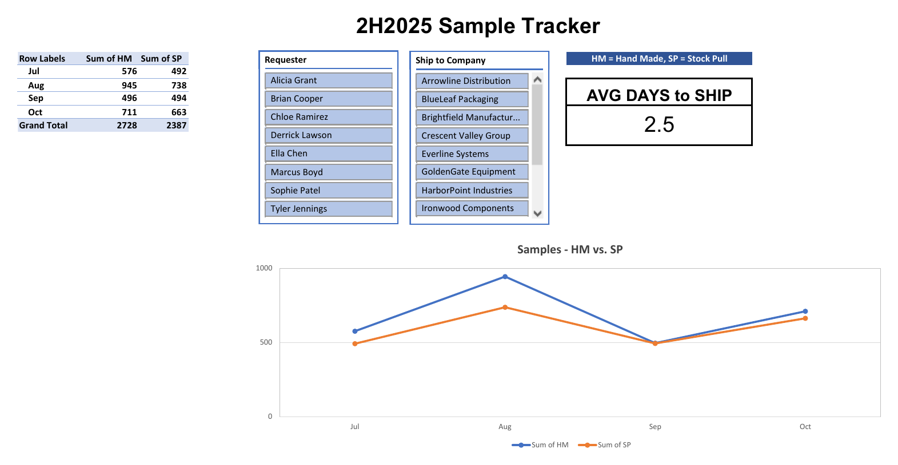

# Sample Tracker Dashboard: Manufacturer Two

**Excel · Tables · Pivot Tables · Date Grouping · Slicers · Line Chart**

> Manufacturer Two supplies caps and closures. All data in this project is synthetic: requesters, customers, dates and quantities are invented. The layout and the questions it answers are how I built it.



## The problem

Customers often needed **samples** of our caps and closures to check fit, color and finish on their own containers before placing an order. Samples went out constantly, but nobody was tracking them. There was no record of how many we sent, who asked for them, or what the shipping cost.

My manager asked for a way to see it, so I built this tracker from scratch. I designed the dashboard to be presentation-ready, so it could go straight to leadership without anyone having to rework it.

## The questions

- **How many samples are we sending**, and how does that change month to month?
- **Who are our heaviest requesters?** Samples cost money to make and ship, so this is a financial question.
- **Are we paying for what actually shipped?** Checking the log against UPS and FedEx charges meant we weren't billed for packages that never went out.

## What I did

| Step | Action |
|---|---|
| 1 | Logged every request in an **Excel table**: Request Date, Ship Date, Requester, Ship to Company, and units split into **HM** (Hand Made) and **SP** (Stock Pull) |
| 2 | Calculated **Days to Ship** (`Ship Date − Request Date`) and a **Total** of HM + SP for every row |
| 3 | Built a **pivot table** of HM and SP units, **grouped by month of Ship Date**, so a sample counts in the month it actually left the building |
| 4 | Added a **line chart** of HM vs. SP by month |
| 5 | Added **slicers** for Requester and Ship to Company, so anyone can click one person or one customer and see just theirs |
| 6 | Added **Average Days to Ship** as the headline turnaround number |

## What the sample data shows

In the synthetic data (100 requests shipped July–October 2025):

- **5,115 sample units** went out: 2,728 Hand Made and 2,387 Stock Pull. Hand Made samples take more work, and they were just over half of all units.
- **August was the busiest month** (945 HM, 738 SP).
- **Two requesters made over a third of all requests** (18 each), which is exactly the kind of pattern the Requester slicer is for.
- **Average turnaround was 2.5 days.** 16 samples shipped the same day they were requested, and none took longer than 6 days.

## Inside the workbook

`Manufacturer_Two_Sample_Tracker.xlsx`

| Tab | What's there |
|---|---|
| **Dashboard** | The HM vs. SP pivot by ship month, the line chart, Requester and Ship to Company slicers, and Average Days to Ship |
| **data** | The request log as an Excel table (`SampleData`) |

### Key formulas

```excel
Days to Ship         =B2-A2
Total                =SUM(F2:G2)
Avg Days to Ship     =AVERAGE(SampleData[Days to Ship])
Pivot                Rows: Ship Date grouped by Month · Values: Sum of HM, Sum of SP
```

## About the sample data

I generated the synthetic data with formulas: `RANDBETWEEN` inside `INDEX` to pick a requester and a customer, and `RANDBETWEEN` for the HM and SP quantities. Those formulas recalculate every time anything changes, so the names and numbers kept reshuffling and the dashboard drifted away from the data. For this portfolio version, I converted those columns to **fixed values** so the workbook, the dashboard and these screenshots all match.

## Cleanup for the portfolio

- Converted the random-data columns to plain values (see above)
- Renamed the table from `Q3Data` to `SampleData`, since the data runs through October
- Pointed Average Days to Ship at the table column instead of a fixed range, so it keeps working as rows are added
- Replaced one typed-in Days to Ship value with the same formula as every other row
- Added a legend to the line chart and showed Average Days to Ship to one decimal (2.5)
