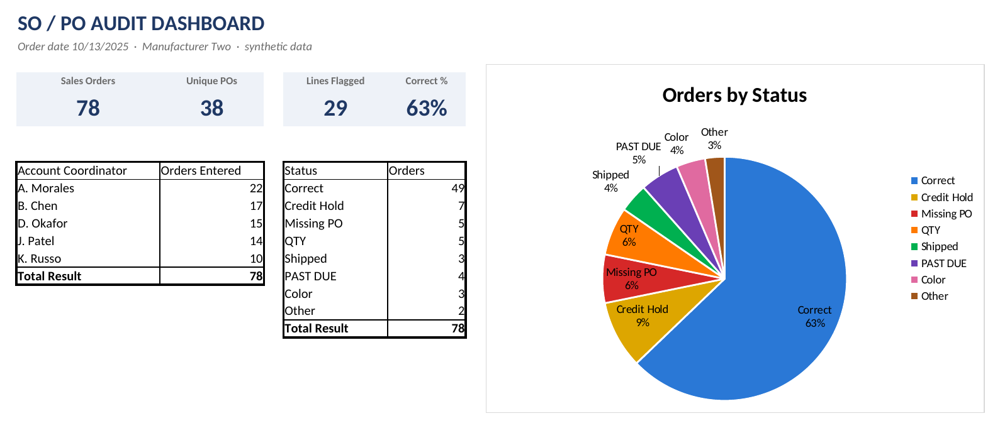
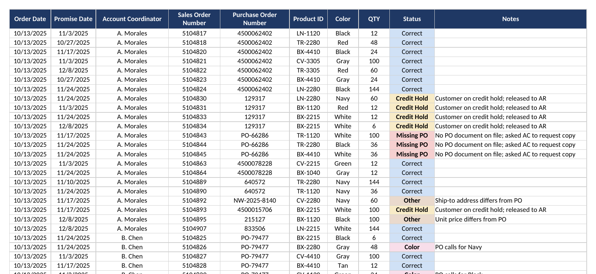

# Sales Order / Purchase Order Audit: Manufacturer Two

**Excel · COUNTA(UNIQUE) · Data Validation · Pivot Tables · Pie Chart**

> Manufacturer Two is my second manufacturing employer. All data in this project is synthetic: coordinators, order numbers, PO numbers, products and quantities are invented. The process and the workbook layout are how I really did it.



## The problem

Every day, the account coordinators entered **65–85 sales orders** from customer purchase orders. Every sales order had to be checked against its PO: right quantity, right color, dates that made sense, and a PO that actually existed.

There was a catch. The sales software created **one sales order per line item**, so a PO with 7 items became 7 sales orders. Counting sales orders told you how many lines you'd checked, but not how many POs you'd researched.

I built this report from the raw order data myself. The **Customer Success team lead** got it every day, and every week I sent the full set in one email to my boss, the **Director of Customer Success**.

## The question

**How many orders were entered correctly, and when they weren't, what went wrong and who entered them?**

## The big catch

One order was in the system for **57,000 units**. The customer's PO said **5,700**.

One extra zero, and it would have gone to the floor at ten times the real quantity. The audit caught it before it did. That's the whole reason to check every line against its PO, even on the days when it feels tedious.

The sample data includes the same mistake (Sales Order 5104842) so you can see how it shows up in the workbook: flagged **QTY**, with the PO and SO quantities side by side in Notes.

## What I did

| Step | Action |
|---|---|
| 1 | Pulled the day's sales orders into one sheet: Order Date, Promise Date, Account Coordinator, Sales Order Number, Purchase Order Number, Product ID, Color, QTY |
| 2 | Checked each line against its PO and picked a result from a **Status dropdown** (data validation): *Correct, Credit Hold, Missing PO, QTY, Shipped, PAST DUE, Color, Other* |
| 3 | **COUNTA** under the Sales Order column for the number of lines audited |
| 4 | **COUNTA(UNIQUE)** under the PO column for the number of distinct POs researched, since one PO could be several sales orders |
| 5 | **COUNTBLANK** under Status as an "are we there yet?" counter. It was purely for my mental health on the long days and never made it into the report. |
| 6 | Built the dashboard: a **pivot table by Account Coordinator** (orders entered), a **pivot table by Status**, and a **pie chart** of the Status pivot in my own color palette |

## What the sample day shows

In this synthetic day (10/13/2025):

- **78 sales orders**, but only **38 distinct POs**. Without UNIQUE, the workload looks twice as big as the research actually was.
- **63% of lines were correct.** The other 29 lines were flagged.
- **Credit holds were the biggest single issue** (7 lines), followed by Missing PO and QTY (5 each). One of those QTY lines is the 57,000-vs-5,700 order.
- Order entry was uneven: one coordinator entered 22 lines while another entered 10, which the coordinator pivot makes obvious at a glance.

## Inside the workbook

`Manufacturer_Two_SO_PO_Audit.xlsx`

| Tab | What's there |
|---|---|
| **SO PO Audit** | The day's sales orders, the Status dropdown, color-coded statuses, a Notes column, and the COUNTA / COUNTA(UNIQUE) / COUNTBLANK counts under their columns |
| **Dashboard** | Summary boxes (Sales Orders, Unique POs, Lines Flagged, Correct %), the two pivot tables, and the Orders by Status pie chart |



> **Opening the file:** UNIQUE needs Excel for Microsoft 365, Excel 2021 or later, or the free Excel for the web. Older versions show the saved result but can't recalculate it. The pivot tables refresh when the file opens.

### Key formulas

```excel
Sales Orders     =COUNTA(D2:D79)
Unique POs       =COUNTA(UNIQUE(E2:E79))
Left to Audit    =COUNTBLANK(I2:I79)
Lines Flagged    =COUNTA('SO PO Audit'!$I$2:$I$79)-COUNTIF('SO PO Audit'!$I$2:$I$79,"Correct")
Correct %        =IFERROR(COUNTIF('SO PO Audit'!$I$2:$I$79,"Correct")/COUNTA('SO PO Audit'!$I$2:$I$79),0)
Status dropdown  Data Validation → List: Correct, Credit Hold, Missing PO, QTY, Shipped, PAST DUE, Color, Other
```

### Status colors

| Status | Color |
|---|---|
| Correct | Blue |
| Credit Hold | Yellow |
| Missing PO | Red |
| QTY | Orange |
| Shipped | Green |
| PAST DUE | Purple |
| Color | Pink |
| Other | Brown |

Every slice of the pie is labeled with its status and percentage, so it still reads for someone who is colorblind.

## Then vs. now

| Then | Now |
|---|---|
| Status dropdown, COUNTA, COUNTA(UNIQUE), COUNTBLANK, two pivots and a color-coded pie | All of that, kept as I built it |
| – | **Notes column** saying what was wrong on each flagged line (for example, "PO calls for Navy") |
| – | **Conditional formatting** on Status in the same colors as the pie, so problems stand out on the audit sheet too |
| – | **Summary boxes** on the dashboard: Sales Orders, Unique POs, Lines Flagged, Correct % |
